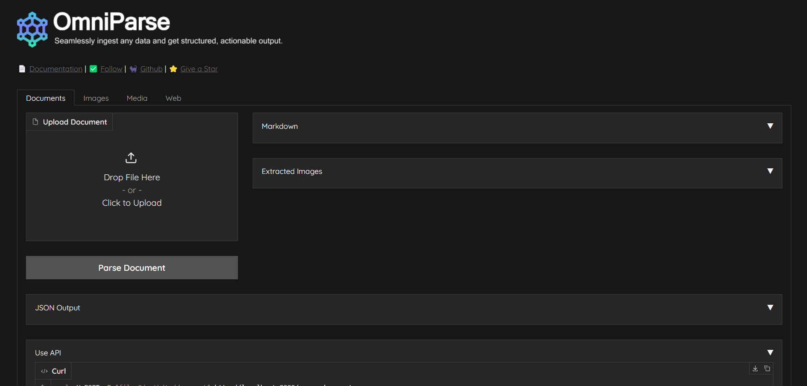

# OmniParse

&#x20;[](https://github.com/adithya-s-k/omniparse/stargazers) [](https://github.com/adithya-s-k/omniparse/network/members) [](https://github.com/adithya-s-k/omniparse/issues) [](https://github.com/adithya-s-k/omniparse/pulls) [](../LICENSE)

> **OmniParse is a platform that ingests/parses any unstructured data into structured, actionable data optimized for GenAI (LLM) applcaitons. Whether working with documents, tables, images, videos, audio files, or web pages, OmniParse prepares your data to be clean, structured and ready for AI applications, such as RAG , fine-tuning and more.**

### Try it out

[](https://colab.research.google.com/github/adithya-s-k/omniparse/blob/main/examples/OmniParse\_GoogleColab.ipynb)&#x20;

<figure><figcaption><p>OmniPrase UI</p></figcaption></figure>

### Features

✅ Completely local, no external APIs\
✅ Fits in a T4 GPU\
✅ Supports 10+ file types\
✅ Convert documents, multimedia, and web pages to high-quality structured markdown\
✅ Table extraction, image extraction/captioning, audio/video transcription, web page crawling\
✅ Easily deployable using Docker and Skypilot\
✅ Colab friendly

#### Problem Statement

It's challenging to process data as it comes in different shapes and sizes. OmniParse aims to be an ingestion/parsing platform where you can ingest any type of data, such as documents, images, audio, video, and web content, and get the most structured and actionable output that is GenAI (LLM) friendly.

| Original PDF                                                                                                                                                                               | OmniParse                                                                                                                                                                            | PyPDF                                                                                                                                                               |
| ------------------------------------------------------------------------------------------------------------------------------------------------------------------------------------------ | ------------------------------------------------------------------------------------------------------------------------------------------------------------------------------------ | ------------------------------------------------------------------------------------------------------------------------------------------------------------------- |
| [](https://github.com/adithya-s-k/marker-api/blob/master/data/images/original\_pdf.png) | [](https://github.com/adithya-s-k/marker-api/blob/master/data/images/marker\_api.png) | [](https://github.com/adithya-s-k/marker-api/blob/master/data/images/pypdf.png) |

### Installation

> Note: The server only works on Linux-based systems. This is due to certain dependencies and system-specific configurations that are not compatible with Windows or macOS. To install OmniParse, you can use `pip`:

```bash
git clone https://github.com/adithya-s-k/omniparse
cd omniparse
```

Create a Virtual Environment:

```bash
conda create --name omniparse-venv python=3.10
conda activate omniparse-venv
```

Install Dependencies:

```bash
poetry install
# or
pip install -e .
```

#### 🛳️ Docker

To use OmniParse with Docker, execute the following commands:

1. Pull the OmniParse API Docker image from Docker Hub:
2. Run the Docker container, exposing port 8000: 👉🏼[Docker Image](https://hub.docker.com/r/savatar101/omniparse)

```bash
docker pull savatar101/omniparse:0.1
# if you are running on a gpu 
docker run --gpus all -p 8000:8000 savatar101/omniparse:0.1
# else
docker run -p 8000:8000 savatar101/omniparse:0.1
```

Alternatively, if you prefer to build the Docker image locally: Then, run the Docker container as follows:

```bash
docker build -t omniparse .
# if you are running on a gpu
docker run --gpus all -p 8000:8000 omniparse
# else
docker run -p 8000:8000 omniparse

```

### Usage

Run the Server:

```bash
python server.py --host 0.0.0.0 --port 8000 --documents --media --web
```

* `--documents`: Load in all the models that help you parse and ingest documents (Surya OCR series of models and Florence-2).
* `--media`: Load in Whisper model to transcribe audio and video files.
* `--web`: Set up selenium crawler.

### Running the Server

To start the API server, run the following command:

```
python main.py --host 0.0.0.0 --port 8000
```

Arguments:

* `--host`: Host IP address (default: 0.0.0.0)
* `--port`: Port number (default: 8000)

### Supported Data Types

| Type      | Supported Extensions                  |
| --------- | ------------------------------------- |
| Documents | .doc, .docx, .odt, .pdf, .ppt, .pptx  |
| Images    | .png, .jpg, .jpeg, .tiff, .bmp, .heic |
| Video     | .mp4, .mkv, .avi, .mov                |
| Audio     | .mp3, .wav, .aac                      |
| Web       | dynamic webpages, http://.com         |

<details>

<summary>API Endpoints</summary>

Client library compatible with Langchain, llamaindex, and haystack integrations coming soon.

* API Endpoints
  * Document Parsing
    * Parse Any Document
    * Parse PDF
    * Parse PowerPoint
    * Parse Word Document
  * Media Parsing
    * Parse Any Media
    * Parse Image
    * Process Image
    * Parse Video
    * Parse Audio
  * Website Parsing
    * Parse Website

#### Document Parsing

**Parse Any Document**

Endpoint: `/parse_document` Method: POST

Parses PDF, PowerPoint, or Word documents.

Curl command:

```
curl -X POST -F "file=@/path/to/document" http://localhost:8000/parse_document
```

**Parse PDF**

Endpoint: `/parse_document/pdf` Method: POST

Parses PDF documents.

Curl command:

```
curl -X POST -F "file=@/path/to/document.pdf" http://localhost:8000/parse_document/pdf
```

**Parse PowerPoint**

Endpoint: `/parse_document/ppt` Method: POST

Parses PowerPoint presentations.

Curl command:

```
curl -X POST -F "file=@/path/to/presentation.ppt" http://localhost:8000/parse_document/ppt
```

**Parse Word Document**

Endpoint: `/parse_document/docs` Method: POST

Parses Word documents.

Curl command:

```
curl -X POST -F "file=@/path/to/document.docx" http://localhost:8000/parse_document/docs
```

#### Media Parsing

**Parse Image**

Endpoint: `/parse_media/image` Method: POST

Parses image files (PNG, JPEG, JPG, TIFF, WEBP).

Curl command:

```
curl -X POST -F "file=@/path/to/image.jpg" http://localhost:8000/parse_media/image
```

**Process Image**

Endpoint: `/parse_media/process_image` Method: POST

Processes an image with a specific task.

Possible task inputs: `OCR | OCR with Region | Caption | Detailed Caption | More Detailed Caption | Object Detection | Dense Region Caption | Region Proposal`

Curl command:

```
curl -X POST -F "image=@/path/to/image.jpg" -F "task=Caption" -F "prompt=Optional prompt" http://localhost:8000/parse_media/process_image
```

Arguments:

* `image`: The image file
* `task`: The processing task (e.g., Caption, Object Detection)
* `prompt`: Optional prompt for certain tasks

**Parse Video**

Endpoint: `/parse_media/video` Method: POST

Parses video files (MP4, AVI, MOV, MKV).

Curl command:

```
curl -X POST -F "file=@/path/to/video.mp4" http://localhost:8000/parse_media/video
```

**Parse Audio**

Endpoint: `/parse_media/audio` Method: POST

Parses audio files (MP3, WAV, FLAC).

Curl command:

```
curl -X POST -F "file=@/path/to/audio.mp3" http://localhost:8000/parse_media/audio
```

#### Website Parsing

**Parse Website**

Endpoint: `/parse_website` Method: POST

Parses a website given its URL.

Curl command:

```
curl -X POST -H "Content-Type: application/json" -d '{"url": "https://example.com"}' http://localhost:8000/parse_website
```

Arguments:

* `url`: The URL of the website to parse

</details>

### Coming Soon/ RoadMap

🦙 LlamaIndex | Langchain | Haystack integrations coming soon 📚 Batch processing data ⭐ Dynamic chunking and structured data extraction based on specified Schema\
🛠️ One magic API: just feed in your file prompt what you want, and we will take care of the rest\
🔧 Dynamic model selection and support for external APIs\
📄 Batch processing for handling multiple files at once\
📦 New open-source model to replace Surya OCR and Marker

**Final goal**: replace all the different models currently being used with a single MultiModel Model to parse any type of data and get the data you need.

### License

OmniParse is licensed under the GPL-3.0 license. See `LICENSE` for more information.

### Acknowledgements

This project builds upon the remarkable [Marker](https://github.com/VikParuchuri/marker) project created by [Vik Paruchuri](https://twitter.com/VikParuchuri). We express our gratitude for the inspiration and foundation provided by this project. Special thanks to [Surya-OCR](https://github.com/VikParuchuri/surya) and [Texify](https://github.com/VikParuchuri/texify) for the OCR models extensively used in this project, and to [Crawl4AI](https://github.com/unclecode/crawl4ai) for their contributions.

Models being used:

* Surya OCR, Detect, Layout, Order, and Texify
* Florence-2 base
* Whisper Small

Thank you to the authors for their contributions to these models.

***

<figure><figcaption></figcaption></figure>
